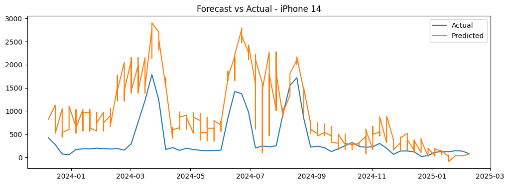

# 📈 iPhone Sales Forecasting

**Goal:** Forecast the next 8 weeks of weekly iPhone unit sales per model, incorporating:
- Historical sales
- Product lifecycle (cold start)
- Promotions / discounts
- Seasonality

This mirrors real-world retail forecasting use cases in inventory management and supply chain optimization.

---

## 🚀 Project Overview

| Category                   | Details                                |
|----------------------------|----------------------------------------|
| Problem                    | Multi-product weekly sales forecasting |
| Data Source                | Proprietary iPhone sales data          |
| Forecast Horizon           | 8 weeks ahead                          |
| Key Metrics                | MAPE, WAPE, RMSE                       |
| Final Model                | LightGBM (gradient boosting)           |
| Deployment                 | (to be added: Streamlit / API)         |

---

## 📂 Project Structure

iphone_sales_forecasting/
├── data/ # Raw data (excluded from GitHub)
├── models/ # Saved LightGBM model
├── notebooks/ # Analysis and modeling notebooks
├── src/ # Modular Python code
├── requirements.txt # Environment dependencies
└── README.md # Project documentation


---

## 📊 Methodology

### 1️⃣ EDA & Problem Framing
- Weekly sales analyzed per iPhone model
- Seasonality and lifecycle effects identified
- Promotions detected as sales spikes

### 2️⃣ Baseline Models
- Prophet and naive forecasting evaluated
- Volatile sales segments revealed baseline weaknesses

### 3️⃣ LightGBM Supervised Learning
- Features:
  - Lagged sales (`t-1`, `t-2`, `t-4`)
  - Rolling mean (4 weeks)
  - Promotions flag
  - Product age (weeks since launch)
  - Time encodings (week of year)
- Trained per-product and globally using LightGBM

### 4️⃣ Time-Based Backtesting
- Rolling-window evaluation (2019–2024)
- Forecasted next 8 weeks per window
- Evaluated using MAPE, WAPE, and RMSE

---

## 📊 Results

| Metric        | Value     |
|---------------|-----------|
| Global WAPE   |    2 %    |
| Global MAPE   | ~909 %    |
| Global RMSE   | ~793 units|

> **Note:** High MAPE explained by small-actual weeks inflating % errors. WAPE preferred for business evaluation.

Sample Forecast vs Actuals (iPhone 14):




## 📌 Key Takeaways

- Built multi-product sales forecasting pipeline
- Integrated promotions and seasonality handling
- Applied LightGBM with lag features and rolling statistics
- Time-based validation and error analysis per product
- Ready for deployment and further iterations

---

## ⚙️ How to Run

```bash
# Install dependencies
pip install -r requirements.txt

# Train final model
python -m src.final_model

# Run notebooks for analysis
jupyter notebook
```
